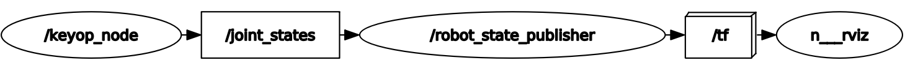
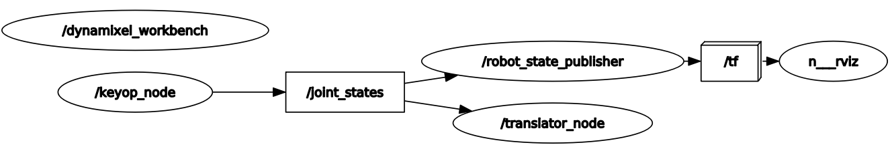
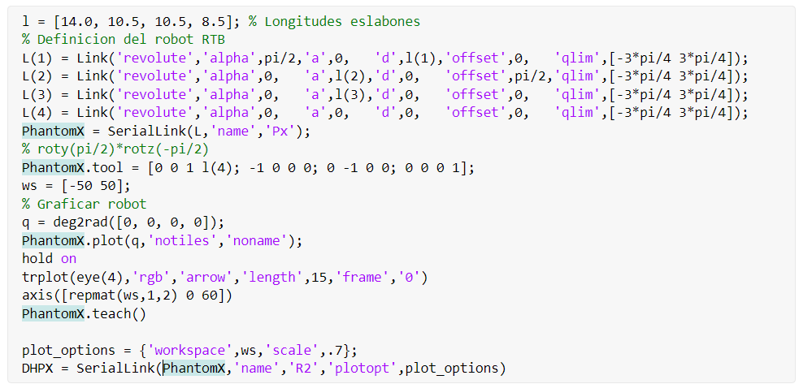
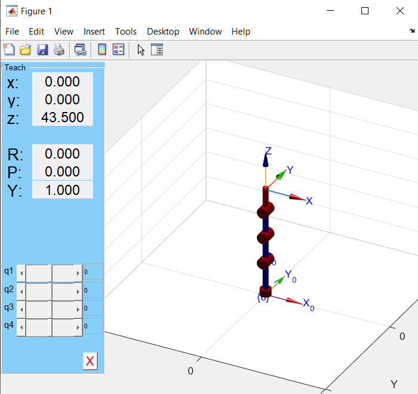
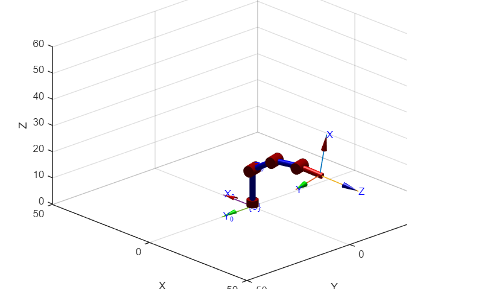
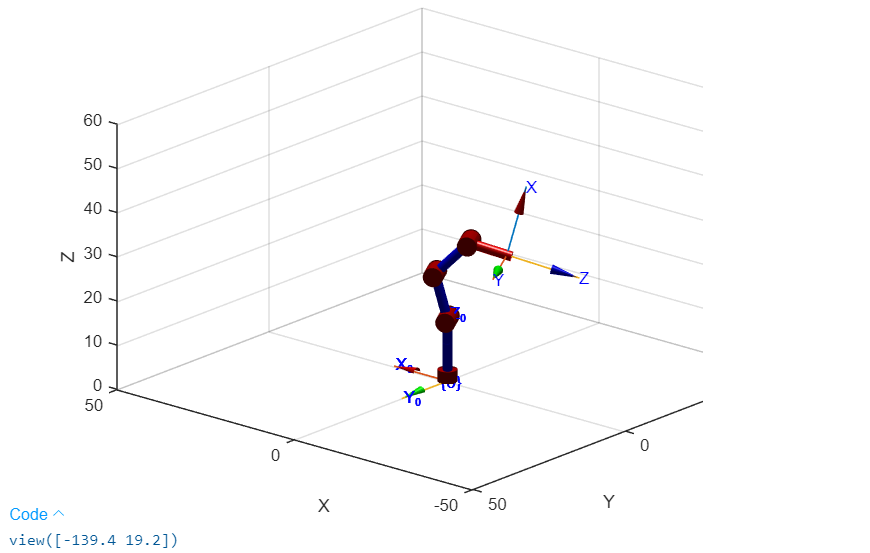

## robotics-ros-2-phantomx-forward_kinematics

# KEYOP PHANTOMX ROBOT WITH ROS

This repository shows how to connect and operate via keyboard a Phantom X robot with ROS.

> ## Contributors
> 
> - [Camilo Andrés Borda Gil](https://github.com/Canborda) (caabordagi@unal.edu.co)
> - Paula Sofía Medina Diaz (psmedinadi@unal.edu.co)
> - Robinson Jair Orduz Gomez (rjorduzg@unal.edu.co)

---
## How to Use the Package

The first thing to do is to clone this repository (inside your catkin workspace) and build the package for ROS:

```
git clone https://github.com/Canborda/robotics-ros-2-phantomx-forward_kinematics.git
catkin build robotics-ros-2-phantomx-forward_kinematics
source devel/setup.bash
```

Make sure you have those python libraries installed (we use them for the `keyop_node`):

- [Py console](https://pypi.org/project/py-console/)
- [Pynput](https://pypi.org/project/pynput/)

To launch the package you have two modes: you can test it with a real [PhantomX Robot Arm](https://www.trossenrobotics.com/p/PhantomX-Pincher-Robot-Arm.aspx) in the **controller mode** or just visualize the robot in Rviz in the **simulation mode**.

<br>

### **Simulation Mode**

<br>

```
roslaunch robotics-ros-2-phantomx-forward_kinematics px_rviz_keyop.launch
```

For this mode you won't need anything additional to this package! It will start the Rviz interface with a model of the _PhantomX robot_ and a cli to control the different joints position.

This command will start the `keyop_node` which publishes a message of type [sensor_msgs/JointState Message](http://docs.ros.org/en/melodic/api/sensor_msgs/html/msg/JointState.html) via a topic called `/joint_states`; and the `robot_state_publisher` node which is subscribed to the same topic and process all info to update the robot pose in Rviz. This is the **rqt_graph** for the simulation mode:
<p align="center"></p>

#### Demonstration
https://github.com/Canborda/robotics-ROS-2-PhantomX-forward_kinematics/assets/55401093/8849acc1-fdd9-45cb-8839-ffa4ed3ad2b4

<br>

### **Controller Mode**

<br>

```
roslaunch robotics-ros-2-phantomx-forward_kinematics px_controllers.launch
```

This command will start several nodes:

- The `dynamixel_workbench` node allows the communication between ROS and the robot.
- The `keyop_node` starts a pretty cli so you can select a joint to move or change between five predefined positions (same node as in simulation mode).
- The `translator_node` just receives all the joints position in radians from the keyop node, and maps them into the bit-level units for the dynamixel package.
- The `rviz` node for **real time visualization** of your robot configuration.

The **rqt_graph** for the controller mode is the following:
<p align="center"></p>

#### Demonstration
https://github.com/Canborda/robotics-ROS-2-PhantomX-forward_kinematics/assets/55401093/40f4864a-cd97-4052-b25b-a71fba0bcf25

<br>

---

<br>

## Procedimiento


Establezca las longitudes de eslabón para cada articulación del robot Phantom X Pincher, para este proceso apóyese en un CALIBRADOR. Recuerde que la longitud de eslabón es la mínima distancia que conecta dos juntas consecutivas. Genere un diagrama como el presentado en la figura 2 con los datos medidos.

Análisis:

- Con las dimensiones medidas obtenga los parámetros DHstd del robot Phantom X Pincher.
- Genere diagrama del robot con las tablas de parámetros articulares.

|     | ai  | alpha | di  | Theta | off  |
| --- | --- | ----- | --- | ----- | ---- |
| 1   | 0   | Pi/2  | l1  | q1    | 0    |
| 2   | l2  | 0     | 0   | q2    | Pi/2 |
| 3   | l3  | 0     | 0   | q3    | 0    |
| 4   | l4  | 0     | 0   | q4    | 0    |


Teniendo en cuenta que:


|     | medida(mm) |
| --- | ---------- |
| l1  |    140     |
| l2  |    105     |
| l3  |    105     |
| l4  |    85      |

<br>

## ToolBox:



```

DHPX =

R2 (4 axis, RRRR, stdDH, fastRNE)

+---+-----------+-----------+-----------+-----------+-----------+
| j |     theta |         d |         a |     alpha |    offset |
+---+-----------+-----------+-----------+-----------+-----------+
|  1|         q1|         14|          0|      1.571|          0|
|  2|         q2|          0|       10.5|          0|      1.571|
|  3|         q3|          0|       10.5|          0|          0|
|  4|         q4|          0|          0|          0|          0|
+---+-----------+-----------+-----------+-----------+-----------+

grav =    0  base = 1  0  0  0   tool =   0           0           1         8.5
          0         0  1  0  0           -1           0           0           0
       9.81         0  0  1  0            0          -1           0           0
                    0  0  0  1            0           0           0           1

```

q = [0, 0, 0, 0]



q = [15, 60, 30, 10]



q = [30, -15, 60, 60]


